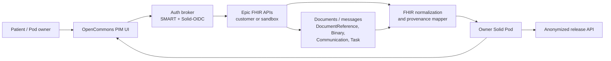

# Epic integration roadmap for OpenCommons Health PIM

This roadmap describes the next development cycle for standards-based Epic
data streams, workflow, document management, and messaging integration with
OpenCommons Health PIM. It is intended for feature and issue management.

## Scope and standards posture

OpenCommons Health PIM remains a patient-owned Solid pod application. Epic is
an external clinical system of record. The integration must never assume that
Epic data can be copied or redistributed without the authenticated
owner/patient's authorization and the health system's configured access rules.

The active MVP scope is restricted to localhost notebook deployment. The
supported MVP targets are the container-local and host-local flows documented in
[`LOCALHOST_MVP_SCOPE.md`](./LOCALHOST_MVP_SCOPE.md). Native iPad/iPhone
deployment, mobile SMART redirect handling, embedded mobile pod storage, and
HealthKit/Spezi work are deferred until after the localhost MVP is stable.

Standards and source-of-truth references:

- SMART App Launch / OAuth 2.0 for patient-facing and clinician-facing
  authorization.
- SMART Backend Services only for organization-approved, non-interactive jobs.
- HL7 FHIR REST APIs for data exchange, preferably R4 when integrating with
  Epic deployments and mapped into the local FHIR-aligned PIM model.
- Epic on FHIR app registration, sandbox testing, customer download, and
  customer-specific endpoint configuration.
- Solid-OIDC and Solid pod access control for locally owned storage.
- OpenCommons anonymized release APIs for any downstream non-owner release.

The PIM's existing `/fhir/metadata` endpoint describes the local PIM
capabilities; Epic capability discovery must be performed against the
customer-specific Epic FHIR base URL and its SMART configuration.

## Reference architecture

### Component responsibilities

| Component | Responsibility |
|---|---|
| PIM UI | Connect Epic account, show requested scopes, preview imports, reconcile changes, approve anonymized release. |
| Auth broker | Maintain separate Solid and SMART sessions; store Epic refresh material only when explicitly enabled and encrypted. |
| Epic connector | Read authorized FHIR resources, normalize paging/errors, preserve Epic provenance, and avoid unsupported writes until enabled by site policy. |
| FHIR mapper | Convert Epic FHIR resources into PIM domain entities while preserving source references, codes, timestamps, and confidence. |
| Solid pod | Store owner-controlled identifiable PHI and imported clinical artifacts. |
| Document/message adapter | Map Epic `DocumentReference`, `Binary`, `Communication`, `Task`, `QuestionnaireResponse`, and related workflow resources into owner-facing PIM views. |
| Release API | Expose only anonymized data after authenticated owner approval and a declared purpose. |

## Epic integration lanes

### Lane 1: Patient-mediated import

Primary use case: a patient connects their Epic/MyChart account and imports
records into their own Solid pod.

Feature issues:

1. Register OpenCommons as a patient-facing SMART on FHIR app in Epic sandbox.
2. Implement SMART discovery from the Epic FHIR base URL.
3. Implement authorization-code-with-PKCE launch and callback.
4. Request minimum read scopes by domain:
   - `patient/Patient.read`
   - `patient/Condition.rs`
   - `patient/MedicationRequest.rs` and/or `patient/MedicationStatement.rs`
   - `patient/AllergyIntolerance.rs`
   - `patient/Immunization.rs`
   - `patient/Observation.rs`
   - `patient/DiagnosticReport.rs`
   - `patient/DocumentReference.rs`
   - `patient/Coverage.rs`
   - messaging/workflow scopes only where supported by the target Epic site.
5. Add an import preview screen that shows what will be stored before writing
   to the Solid pod.
6. Add provenance to every imported record:
   `sourceSystem`, `sourcePatientId`, `sourceResourceType`, `sourceResourceId`,
   `sourceVersion`, `sourceLastUpdated`, `importedAt`, and `authorizationGrantId`.
7. Add re-sync with conflict detection: new, changed, unchanged, and local-only.

Definition of done:

- The owner can connect, import, disconnect, and delete imported Epic data from
  the PIM without exposing PHI through release APIs.
- Unsupported Epic resources degrade to user-friendly explanations and logged
  diagnostics.
- Sandbox tests use only synthetic Epic data.

### Lane 2: Annual Medicare Wellness Evaluation workflow

Primary use case: after an Annual Medicare Wellness Evaluation, the patient
updates their PIM with new clinical measurements, medication reconciliation,
preventive-care recommendations, and visit documents.

FHIR resources to handle:

| Wellness update | Epic/FHIR resource | PIM domain |
|---|---|---|
| Demographics confirmation | `Patient` | `profiles` |
| Active problems and risk factors | `Condition` | `conditions` |
| Medication reconciliation | `MedicationRequest`, `MedicationStatement` | `medications` |
| Allergies review | `AllergyIntolerance` | `allergies` |
| Immunization review | `Immunization` | `immunizations` |
| Vitals, BMI, BP, cognitive/depression screening scores | `Observation` | `vital-signs`, `lab-results` when applicable |
| Preventive plan | `CarePlan`, `Goal`, `ServiceRequest`, `Task` | future `care-plans` / workflow adapter |
| After-visit summary and uploaded forms | `DocumentReference`, `Binary` | future document library |
| Patient questionnaire | `QuestionnaireResponse` | future workflow/document adapter |
| Medicare coverage context | `Coverage` | `insurance-policies` |

Feature issues:

1. Add a "Medicare Wellness Update" guided import view.
2. Fetch a bounded date window around the wellness encounter.
3. Group retrieved resources into review sections: profile, diagnoses,
   medications, allergies, immunizations, vitals/labs, insurance, documents,
   tasks/messages.
4. Require owner confirmation before each section is saved to the pod.
5. Preserve previous values and show change summaries.
6. Create a generated local wellness summary document in the pod with links to
   source Epic `DocumentReference` records when available.
7. Add anonymized wellness summary release for approved research or care
   coordination use cases with no direct identifiers.

Definition of done:

- The patient can complete the wellness update without editing raw FHIR.
- New and changed records are visible in the existing nine PIM domains.
- Direct identifiers and exact source document URLs are excluded from
  anonymized release responses.

### Lane 3: Document management

Primary use case: the patient reviews clinical documents, after-visit summaries,
care instructions, and Medicare Wellness Evaluation documents inside the PIM.

Feature issues:

1. Add document repository and schema for owner-held documents.
2. Map Epic `DocumentReference` metadata and associated `Binary` payloads.
3. Store document metadata in RDF and binary payloads in a pod document
   container with owner-only ACLs.
4. Add document type filters: visit summary, lab report, care plan,
   questionnaire, referral, consent, insurance.
5. Add checksum, content type, source, and imported-at metadata.
6. Add redaction/anonymization transform for permitted document-derived
   releases.

Definition of done:

- Document metadata and payload availability are independently validated.
- Missing or access-denied binaries do not block the rest of the import.
- Downloads require authenticated owner access.

### Lane 4: Messaging and workflow

Primary use case: the PIM presents owner-approved message and task context
without becoming an unmanaged clinical inbox.

Feature issues:

1. Determine site-supported messaging resources and write policies.
2. Implement read-only message/task import first.
3. Map Epic/FHIR resources:
   - `Communication` for message history where available.
   - `Task` for to-dos, follow-ups, and document requests.
   - `ServiceRequest` for ordered follow-up work.
   - `Questionnaire` and `QuestionnaireResponse` for pre-visit or wellness
     forms.
4. Add status states: imported, needs review, patient completed, sent to
   provider, closed, unavailable.
5. Keep outbound write/send disabled until a health-system-specific policy and
   audit design are approved.

Definition of done:

- Read-only workflow context is visible in the PIM.
- No task/message is written back to Epic unless the site-specific write path is
  explicitly enabled and tested.

### Lane 5: Operational readiness

Feature issues:

1. Add Epic connector configuration:
   `EPIC_FHIR_BASE_URL`, `EPIC_CLIENT_ID`, `EPIC_REDIRECT_URI`,
   `EPIC_SCOPES`, `EPIC_ENVIRONMENT`, and encrypted secret storage.
2. Add connector health checks:
   SMART discovery reachable, token endpoint reachable, FHIR metadata reachable,
   configured scopes present, sandbox/prod environment label.
3. Add audit records for connect, import preview, save-to-pod, disconnect, and
   anonymized release.
4. Add failure taxonomy:
   auth expired, authorization denied, scope missing, Epic not reachable,
   resource unsupported, FHIR validation failed, pod write failed, conflict.
5. Extend deployment verification with optional Epic sandbox checks.

Definition of done:

- Host-local and container deployments can run with Epic disabled by default.
- Enabling Epic requires explicit environment configuration.
- No Epic secret is written to source, logs, or OpenAPI examples.

## Use-case based test matrix

| Use case | Test type | Success criteria |
|---|---|---|
| Connect Epic sandbox account | Playwright + mocked/sandbox SMART | User sees scope consent, returns to PIM, connector status is connected. |
| Import baseline clinical data | API + Playwright | PIM preview shows Patient, Condition, Medication, Allergy, Immunization, Observation, DiagnosticReport, Coverage. |
| Annual Medicare Wellness update | Playwright E2E | User enters or imports wellness changes and sees updated conditions, medications, vitals, lab results, insurance, and document summary. |
| Owner-approved anonymized release | API + Playwright | Release endpoint requires authentication, approval header, purpose header, and returns no direct identifiers. |
| Epic auth expiry | API + Playwright | UI explains reconnect steps without losing pod data. |
| Unsupported resource at customer site | API integration | Connector logs unsupported capability and skips the section with user-facing explanation. |
| DocumentReference without Binary access | API integration | Metadata is retained; unavailable payload is marked without failing full import. |
| Message/task read-only mode | API + Playwright | Workflow data is visible; outbound send controls are disabled unless configured. |

## Backlog structure

Recommended issue labels:

- `epic`
- `smart-on-fhir`
- `fhir-mapping`
- `solid-storage`
- `privacy`
- `documents`
- `workflow`
- `playwright-e2e`
- `deployment`
- `next-cycle`

Recommended milestones:

1. Epic connector foundation.
2. Patient-mediated import MVP.
3. Medicare Wellness workflow.
4. Documents and workflow read-only MVP.
5. Operational hardening and customer pilot.

## MVP implementation phase baseline

The first implementation slice establishes a repeatable local/docker Epic MVP
contract without requiring live Epic sandbox credentials:

- Epic is disabled by default through `EPIC_ENABLED=false`.
- `EPIC_MODE=mock` provides deterministic synthetic Annual Medicare Wellness
  FHIR resources for local development and Playwright automation.
- The owner Solid pod stores Epic connection state, OAuth state, granted
  scopes, sync cursors, audit entries, and encrypted grant material.
- Runtime configuration supplies app-registration values such as FHIR base URL,
  client id, redirect URI, and the local encryption key.
- The PIM exposes `/api/integrations/epic/*` endpoints for status,
  connect/disconnect, preview, apply, and audit.
- Import preview maps FHIR resources into the existing nine domain APIs before
  any pod writes occur.
- Apply-to-pod remains owner-mediated and uses the same domain repositories and
  ShEx/RDF validation path as manual records.

The current implementation also includes live SMART discovery, authorization
code with PKCE request generation, callback token exchange, refresh-token
handling, and patient-scoped FHIR read support when real Epic registration
values are supplied. Those capabilities remain inside the localhost deployment
contract and must not require public hosting or mobile packaging for MVP
validation.

This slice intentionally keeps native iPad/iPhone deployment, outbound Epic
writes, production customer activation, and document/message writeback out of
the MVP until the localhost happy path is fully repeatable.

## Current non-iPad implementation sequence

The active development sequence for the localhost MVP is:

1. Keep Epic disabled by default and preserve the Solid-only local deployment.
2. Keep mock Epic mode deterministic for CI, local release review, and
   Playwright automation.
3. Validate the localhost MVP scope with `npm run validate:localhost-mvp`.
4. Extend optional Epic sandbox diagnostics without making sandbox credentials a
   CI requirement.
5. Improve Annual Medicare Wellness import preview and apply UX against local
   mock data first.
6. Add document/workflow read-only repositories and schemas as localhost APIs
   before any mobile implementation.
7. Continue to require owner approval and anonymization controls for any
   non-owner release.

Native iPad/mobile issues should remain parked as future work unless the
localhost MVP milestone is complete and a new implementation phase is
explicitly opened.
