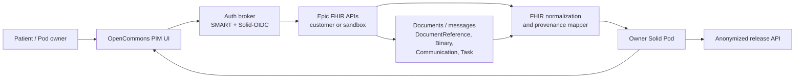

# Epic integration roadmap for OpenCommons Health PIM

This roadmap describes the next development cycle for standards-based Epic
data streams, workflow, document management, and messaging integration with
OpenCommons Health PIM. It is intended for feature and issue management.

## Scope and standards posture

OpenCommons Health PIM remains a patient-owned Solid pod application. Epic is
an external clinical system of record. The integration must never assume that
Epic data can be copied or redistributed without the authenticated
owner/patient's authorization and the health system's configured access rules.

The active MVP scope is restricted to localhost notebook deployment. The
supported MVP targets are the container-local and host-local flows documented in
[`LOCALHOST_MVP_SCOPE.md`](./LOCALHOST_MVP_SCOPE.md). Native iPad/iPhone
deployment, mobile SMART redirect handling, embedded mobile pod storage, and
HealthKit/Spezi work are deferred until after the localhost MVP is stable.

Standards and source-of-truth references:

- SMART App Launch / OAuth 2.0 for patient-facing and clinician-facing
  authorization.
- SMART Backend Services only for organization-approved, non-interactive jobs.
- HL7 FHIR REST APIs for data exchange, preferably R4 when integrating with
  Epic deployments and mapped into the local FHIR-aligned PIM model.
- Epic on FHIR app registration, sandbox testing, customer download, and
  customer-specific endpoint configuration.
- Solid-OIDC and Solid pod access control for locally owned storage.
- OpenCommons anonymized release APIs for any downstream non-owner release.

The PIM's existing `/fhir/metadata` endpoint describes the local PIM
capabilities; Epic capability discovery must be performed against the
customer-specific Epic FHIR base URL and its SMART configuration.

## Reference architecture


```mermaid
flowchart LR
  Owner["Patient / Pod owner"]
  UI["OpenCommons PIM UI"]
  Auth["Auth broker\nSMART + Solid-OIDC"]
  Epic["Epic FHIR APIs\ncustomer or sandbox"]
  Mapper["FHIR normalization\nand provenance mapper"]
  Pod["Owner Solid Pod"]
  Release["Anonymized release API"]
  Docs["Documents / messages\nDocumentReference, Binary,\nCommunication, Task"]

  Owner --> UI
  UI --> Auth
  Auth --> Epic
  Epic --> Mapper
  Mapper --> Pod
  Epic --> Docs
  Docs --> Mapper
  Pod --> UI
  Pod --> Release
```

### Component responsibilities

| Component | Responsibility |
|---|---|
| PIM UI | Connect Epic account, show requested scopes, preview imports, reconcile changes, approve anonymized release. |
| Auth broker | Maintain separate Solid and SMART sessions; store Epic refresh material only when explicitly enabled and encrypted. |
| Epic connector | Read authorized FHIR resources, normalize paging/errors, preserve Epic provenance, and avoid unsupported writes until enabled by site policy. |
| FHIR mapper | Convert Epic FHIR resources into PIM domain entities while preserving source references, codes, timestamps, and confidence. |
| Solid pod | Store owner-controlled identifiable PHI and imported clinical artifacts. |
| Document/message adapter | Map Epic `DocumentReference`, `Binary`, `Communication`, `Task`, `QuestionnaireResponse`, and related workflow resources into owner-facing PIM views. |
| Release API | Expose only anonymized data after authenticated owner approval and a declared purpose. |

## Epic integration lanes

### Lane 1: Patient-mediated import

Primary use case: a patient connects their Epic/MyChart account and imports
records into their own Solid pod.

Feature issues:

1. Register OpenCommons as a patient-facing SMART on FHIR app in Epic sandbox.
2. Implement SMART discovery from the Epic FHIR base URL.
3. Implement authorization-code-with-PKCE launch and callback.
4. Request minimum read scopes by domain:
   - `patient/Patient.read`
   - `patient/Condition.rs`
   - `patient/MedicationRequest.rs` and/or `patient/MedicationStatement.rs`
   - `patient/AllergyIntolerance.rs`
   - `patient/Immunization.rs`
   - `patient/Observation.rs`
   - `patient/DiagnosticReport.rs`
   - `patient/DocumentReference.rs`
   - `patient/Coverage.rs`
   - messaging/workflow scopes only where supported by the target Epic site.
5. Add an import preview screen that shows what will be stored before writing
   to the Solid pod.
6. Add provenance to every imported record:
   `sourceSystem`, `sourcePatientId`, `sourceResourceType`, `sourceResourceId`,
   `sourceVersion`, `sourceLastUpdated`, `importedAt`, and `authorizationGrantId`.
7. Add re-sync with conflict detection: new, changed, unchanged, and local-only.

Definition of done:

- The owner can connect, import, disconnect, and delete imported Epic data from
  the PIM without exposing PHI through release APIs.
- Unsupported Epic resources degrade to user-friendly explanations and logged
  diagnostics.
- Sandbox tests use only synthetic Epic data.

### Lane 2: Annual Medicare Wellness Evaluation workflow

Primary use case: after an Annual Medicare Wellness Evaluation, the patient
updates their PIM with new clinical measurements, medication reconciliation,
preventive-care recommendations, and visit documents.

FHIR resources to handle:

| Wellness update | Epic/FHIR resource | PIM domain |
|---|---|---|
| Demographics confirmation | `Patient` | `profiles` |
| Active problems and risk factors | `Condition` | `conditions` |
| Medication reconciliation | `MedicationRequest`, `MedicationStatement` | `medications` |
| Allergies review | `AllergyIntolerance` | `allergies` |
| Immunization review | `Immunization` | `immunizations` |
| Vitals, BMI, BP, cognitive/depression screening scores | `Observation` | `vital-signs`, `lab-results` when applicable |
| Preventive plan | `CarePlan`, `Goal`, `ServiceRequest`, `Task` | `workflow-tasks` for Task metadata; care-plan expansion later |
| After-visit summary and uploaded forms | `DocumentReference`, `Binary` | `documents` for DocumentReference metadata; Binary payloads later |
| Patient questionnaire | `QuestionnaireResponse` | workflow/document metadata now; structured questionnaire repository later |
| Medicare coverage context | `Coverage` | `insurance-policies` |

Feature issues:

1. Add a "Medicare Wellness Update" guided import view.
2. Fetch a bounded date window around the wellness encounter.
3. Group retrieved resources into review sections: profile, diagnoses,
   medications, allergies, immunizations, vitals/labs, insurance, documents,
   tasks/messages.
4. Require owner confirmation before each section is saved to the pod.
5. Preserve previous values and show change summaries.
6. Create a generated local wellness summary document in the pod with links to
   source Epic `DocumentReference` records when available.
7. Add anonymized wellness summary release for approved research or care
   coordination use cases with no direct identifiers.

Definition of done:

- The patient can complete the wellness update without editing raw FHIR.
- New and changed records are visible in the existing nine PIM domains.
- Direct identifiers and exact source document URLs are excluded from
  anonymized release responses.

### Lane 3: Document management

Primary use case: the patient reviews clinical documents, after-visit summaries,
care instructions, and Medicare Wellness Evaluation documents inside the PIM.

Feature issues:

1. Add document repository and schema for owner-held documents.
2. Map Epic `DocumentReference` metadata and associated `Binary` payloads.
3. Store document metadata in RDF and binary payloads in a pod document
   container with owner-only ACLs.
4. Add document type filters: visit summary, lab report, care plan,
   questionnaire, referral, consent, insurance.
5. Add checksum, content type, source, and imported-at metadata.
6. Add redaction/anonymization transform for permitted document-derived
   releases.

Definition of done:

- Document metadata and payload availability are independently validated.
- Missing or access-denied binaries do not block the rest of the import.
- Downloads require authenticated owner access.

### Lane 4: Messaging and workflow

Primary use case: the PIM presents owner-approved message and task context
without becoming an unmanaged clinical inbox.

Feature issues:

1. Determine site-supported messaging resources and write policies.
2. Implement read-only message/task import first.
3. Map Epic/FHIR resources:
   - `Communication` for message history where available.
   - `Task` for to-dos, follow-ups, and document requests.
   - `ServiceRequest` for ordered follow-up work.
   - `Questionnaire` and `QuestionnaireResponse` for pre-visit or wellness
     forms.
4. Add status states: imported, needs review, patient completed, sent to
   provider, closed, unavailable.
5. Keep outbound write/send disabled until a health-system-specific policy and
   audit design are approved.

Definition of done:

- Read-only workflow context is visible in the PIM.
- No task/message is written back to Epic unless the site-specific write path is
  explicitly enabled and tested.

### Lane 5: Operational readiness

Feature issues:

1. Add Epic connector configuration:
   `EPIC_FHIR_BASE_URL`, `EPIC_CLIENT_ID`, `EPIC_REDIRECT_URI`,
   `EPIC_SCOPES`, `EPIC_ENVIRONMENT`, and encrypted secret storage.
2. Add connector health checks:
   SMART discovery reachable, token endpoint reachable, FHIR metadata reachable,
   configured scopes present, sandbox/prod environment label.
3. Add audit records for connect, import preview, save-to-pod, disconnect, and
   anonymized release.
4. Add failure taxonomy:
   auth expired, authorization denied, scope missing, Epic not reachable,
   resource unsupported, FHIR validation failed, pod write failed, conflict.
5. Extend deployment verification with optional Epic sandbox checks.

Definition of done:

- Host-local and container deployments can run with Epic disabled by default.
- Enabling Epic requires explicit environment configuration.
- No Epic secret is written to source, logs, or OpenAPI examples.

## Use-case based test matrix

| Use case | Test type | Success criteria |
|---|---|---|
| Connect Epic sandbox account | Playwright + mocked/sandbox SMART | User sees scope consent, returns to PIM, connector status is connected. |
| Import baseline clinical data | API + Playwright | PIM preview shows Patient, Condition, Medication, Allergy, Immunization, Observation, DiagnosticReport, Coverage. |
| Annual Medicare Wellness update | Playwright E2E | User enters or imports wellness changes and sees updated conditions, medications, vitals, lab results, insurance, and document summary. |
| Owner-approved anonymized release | API + Playwright | Release endpoint requires authentication, approval header, purpose header, and returns no direct identifiers. |
| Epic auth expiry | API + Playwright | UI explains reconnect steps without losing pod data. |
| Unsupported resource at customer site | API integration | Connector logs unsupported capability and skips the section with user-facing explanation. |
| DocumentReference without Binary access | API integration | Metadata is retained; unavailable payload is marked without failing full import. |
| Message/task read-only mode | API + Playwright | Workflow data is visible; outbound send controls are disabled unless configured. |

## Backlog structure

Recommended issue labels:

- `epic`
- `smart-on-fhir`
- `fhir-mapping`
- `solid-storage`
- `privacy`
- `documents`
- `workflow`
- `playwright-e2e`
- `deployment`
- `next-cycle`

Recommended milestones:

1. Epic connector foundation.
2. Patient-mediated import MVP.
3. Medicare Wellness workflow.
4. Documents and workflow read-only MVP.
5. Operational hardening and customer pilot.

## MVP implementation phase baseline

The first implementation slice establishes a repeatable local/docker Epic MVP
contract without requiring live Epic sandbox credentials:

- Epic is disabled by default through `EPIC_ENABLED=false`.
- `EPIC_MODE=mock` provides deterministic synthetic Annual Medicare Wellness
  FHIR resources for local development and Playwright automation.
- The owner Solid pod stores Epic connection state, OAuth state, granted
  scopes, sync cursors, audit entries, and encrypted grant material.
- Runtime configuration supplies app-registration values such as FHIR base URL,
  client id, redirect URI, and the local encryption key.
- The PIM exposes `/api/integrations/epic/*` endpoints for status,
  connect/disconnect, preview, apply, and audit.
- Import preview maps FHIR resources into the 11 MVP domain APIs before
  any pod writes occur.
- Apply-to-pod remains owner-mediated and uses the same domain repositories and
  ShEx/RDF validation path as manual records.

The current implementation also includes live SMART discovery, authorization
code with PKCE request generation, callback token exchange, refresh-token
handling, and patient-scoped FHIR read support when real Epic registration
values are supplied. Those capabilities remain inside the localhost deployment
contract and must not require public hosting or mobile packaging for MVP
validation.

This slice intentionally keeps native iPad/iPhone deployment, outbound Epic
writes, production customer activation, and document/message writeback out of
the MVP until the localhost happy path is fully repeatable.

## Current non-iPad implementation sequence

The active development sequence for the localhost MVP is:

1. Keep Epic disabled by default and preserve the Solid-only local deployment.
2. Keep mock Epic mode deterministic for CI, local release review, and
   Playwright automation.
3. Validate the localhost MVP scope with `npm run validate:localhost-mvp`.
4. Use `/api/integrations/epic/diagnostics` for localhost Epic configuration
   checks and reserve `?live=true` for explicit sandbox/production SMART
   discovery diagnostics outside credential-free CI.
5. Improve Annual Medicare Wellness import preview and apply UX against local
   mock data first by grouping candidates by PIM domain and applying only
   owner-selected sections.
6. Surface local reconciliation status for Epic preview candidates so create,
   update, unchanged, and conflict states are visible before pod writes.
   The initial localhost P4-A/P4-B implementation adds `ReconciliationSummary`
   to preview responses and renders an owner reconciliation review panel before
   section selection/apply.
7. Keep document/workflow repositories in the localhost MVP completion path at
   `/api/resources/documents` and `/api/resources/workflow-tasks`; the
   `/api/planned/epic/documents` and `/api/planned/epic/workflow` surfaces
   remain read-only Epic integration planning contracts.
8. Continue to require owner approval and anonymization controls for any
   non-owner release.
9. Persist safe Pod activity metadata in `health-pim/audit/activity.ttl` and
   expose the persistence status through `/api/pod/activity`.
10. Keep HealthKitBridge observability PIM-side and metadata-only through
    `/api/pod/healthkit/status` until native/iPhone HealthKit implementation is
    explicitly resumed.

Native iPad/mobile issues should remain parked as future work unless the
localhost MVP milestone is complete and a new implementation phase is
explicitly opened.

See [`LOCALHOST_MVP_DEPLOYMENT_ISSUES.md`](./LOCALHOST_MVP_DEPLOYMENT_ISSUES.md)
for issue-style notes that track localhost deployment hardening and future
hosted/public deployment prerequisites.

## Current implementation review for Epic completion

Status as of the current codebase review:

| Area | Current state | Completion gap |
|---|---|---|
| Local deployment contract | Host-local and container-local startup scripts keep Epic optional and configurable. `npm start` runs the HTTP server, Node 22/24 is the supported runtime, ShEx files are copied into `dist`, and local release gates include Epic mock validation. | Continue to treat local deployment as the authoritative MVP target. Do not make Epic, public DNS, iPad packaging, or production customer activation required for the localhost MVP. |
| Epic configuration | `EPIC_ENABLED`, `EPIC_MODE`, `EPIC_FHIR_BASE_URL`, `EPIC_CLIENT_ID`, `EPIC_CLIENT_SECRET_FILE`, `EPIC_REDIRECT_URI`, `EPIC_SCOPES`, `EPIC_GRANT_ENCRYPTION_KEY`, and `EPIC_SYNC_ON_STARTUP` are modeled in runtime configuration. | Add a guided operator checklist that verifies actual registration values against the target Epic sandbox/customer environment before live personal-data use. |
| SMART authorization | SMART discovery, authorization-code-with-PKCE URL generation, callback state validation, token exchange, refresh handling, and sanitized public status are implemented. Pending PKCE verifier and grant material are encrypted before pod storage. | Validate the complete browser redirect flow against a real Epic sandbox or approved personal provider endpoint and capture failure-specific UX for denied consent, bad state, expired code, missing patient context, missing scopes, and refresh failure. |
| FHIR reads | Live patient-scoped reads currently fetch `Patient`, `Condition`, `MedicationRequest`, `MedicationStatement`, `AllergyIntolerance`, `Immunization`, `Observation`, `DiagnosticReport`, `Coverage`, and `DocumentReference`. 403/404 search responses are skipped without failing the full import. | Add capability-aware fetch planning, bounded date-window parameters, `_since`/pagination evidence where supported, and explicit user-facing summaries when resources are unsupported or withheld by scope/site policy. |
| PIM domain mapping | The mapper converts Epic resources into the 11 MVP domains: profiles, conditions, medications, allergies, immunizations, vital signs, providers, lab results, insurance policies, documents, and workflow tasks. `Task` mapping exists when Task resources are supplied by tests/mock data. | Extend the live fetcher and mapper for Annual Wellness workflow resources not yet read from Epic: `CarePlan`, `Goal`, `ServiceRequest`, `Task`, `Communication`, `Questionnaire`, `QuestionnaireResponse`, `Practitioner`, `Organization`, and `Binary` payload metadata/content handling. |
| Preview and reconciliation | Preview produces `EpicImportCandidate[]` plus `ReconciliationSummary`; apply skips unchanged/conflict candidates and writes selected domains through the existing validated Solid-backed repositories. | Add persistent per-resource sync cursors, richer provenance/version comparison, manual conflict resolution UX, and an apply token so the owner applies the reviewed preview snapshot rather than a newly generated preview. |
| Documents and workflow | Document and workflow repositories exist as first-class local PIM domains. Epic planning surfaces remain read-only and explicitly report writeback disabled. | Move from planning surfaces to live read-only Epic document/workflow imports, including DocumentReference attachment availability, Binary access status, message/task status normalization, and no-write affordances. |
| Privacy and audit | Epic grant material is not returned in public status; audit records cover connect, callback, refresh, apply, startup, and disconnect. Anonymized release controls exist outside the Epic connector. | Add owner-visible Epic consent/authorization history, explicit “delete imported Epic data” support, exportable non-PHI diagnostics bundles, and tests proving Epic source URLs, tokens, patient ids, and document URLs are not released through anonymized APIs. |
| End-to-end automation | Mock Epic connect, preview, apply, audit, planning surfaces, and reconciliation are included in deployment smoke/release validation. | Add a live-safe Playwright/operator script for sandbox manual authorization evidence that never records credentials or PHI, plus CI-safe mock coverage for each newly supported FHIR resource family. |

## Epic completion roadmap: localhost MVP first

The next implementation cycle should be managed as phases P7 through P12. Each
phase keeps the localhost notebook/Solid pod deployment as the happy path and
ends with a commit, pull request, merge, and release-gate validation checkpoint
when the user explicitly asks for the git publication workflow.

### P7: Epic registration readiness and diagnostics hardening

Goal: make the application tell the operator whether supplied Epic app
registration values are usable before any patient PHI is requested.

Development tasks:

1. Add a checklist-oriented Epic configuration page or panel section showing:
   configured mode, FHIR base URL host, registered redirect URI, client id
   presence, requested scope set, and live discovery readiness.
2. Extend `/api/integrations/epic/diagnostics?live=true` to include FHIR
   `CapabilityStatement` reachability in addition to SMART discovery.
3. Compare configured resource families against available capability/search
   support where the target Epic endpoint publishes enough metadata.
4. Add sanitized diagnostics export for issue reporting. It must include no
   access tokens, refresh tokens, authorization codes, patient identifiers,
   document URLs, or raw PHI.

Validation gate:

```bash
npm run validate:localhost-mvp
npm test -- --runTestsByPath tests/unit/integrations/epic.service.test.ts
APP_URL=http://localhost:<app-port> npm run epic:diagnostics
EPIC_DIAGNOSTICS_LIVE=true APP_URL=http://localhost:<app-port> npm run epic:diagnostics
```

The live diagnostics command is allowed to return `attention` while registration
is incomplete; it must fail only for malformed local configuration or unexpected
runtime errors.

Implementation checkpoint:

- Initial P7 slice adds sanitized `registration`, `resourceSupport`, and
  `safeExport` fields to `/api/integrations/epic/diagnostics`.
- Explicit `?live=true` diagnostics now check both SMART discovery and the Epic
  FHIR `CapabilityStatement` endpoint.
- The browser Epic panel includes a registration-readiness checklist and an
  explicit **Check live readiness** action for sandbox/production modes.
- The safe diagnostics export reports configured booleans, hosts, paths, scope
  names, resource-family readiness, and check statuses without returning client
  secrets, grant encryption keys, tokens, authorization codes, patient ids, raw
  FHIR resources, PHI, or document URLs.

### P8: SMART callback and grant lifecycle live proof

Goal: complete a real Epic sandbox or approved provider SMART authorization
flow from localhost without collecting Epic/MyChart credentials in
OpenCommons, Codex, source control, or logs.

Development tasks:

1. Add browser-visible callback outcomes for success, denied consent, expired
   code, state mismatch, missing patient context, missing scope, and token
   exchange failure.
2. Add token refresh test coverage and a reconnect path when no refresh token is
   granted.
3. Persist a human-readable authorization summary in the pod:
   mode, issuer, connected time, granted scope names, last refresh time, and
   disconnect/delete actions.
4. Add a safe manual test runbook for the real Epic login page that records
   only timestamps, endpoint hostnames, status labels, and screenshots with no
   PHI.

Validation gate:

```bash
npm test -- --runTestsByPath tests/unit/integrations/epic.service.test.ts
npm run test:e2e:playwright
npm run local:release-gate
```

Live proof should be stored as a redacted evidence note under `docs/` only
after the owner has reviewed it for PHI.

### P9: Live patient-mediated import preview

Goal: prove that live Epic patient resources can be retrieved, normalized, and
previewed without writing to the Solid pod until the owner approves.

Development tasks:

1. Add preview request parameters for use case and date window:
   `workflow=annual-medicare-wellness`, `from`, `to`, and selected domains.
2. Fetch live resource families using least-privilege patient scopes and
   capture unsupported/empty families as preview diagnostics.
3. Preserve source provenance on every candidate:
   source FHIR base URL, patient context, resource type/id/version,
   `meta.lastUpdated`, import job id, mapper version, and authorization grant
   id.
4. Keep raw FHIR out of ordinary UI and audit output. Provide only display,
   coded summary, action, provenance summary, and reconciliation status.
5. Add CI-safe fixture tests that mirror representative Epic sandbox resources
   for each supported domain.

Validation gate:

```bash
npm test
npm run validate:openapi
npm run test:e2e:playwright
```

The phase is complete when live preview can be demonstrated with real
registration values and mock automation still passes without network access.

### P10: Annual Medicare Wellness workflow completion

Goal: make the Annual Medicare Wellness Evaluation a complete guided workflow
instead of a generic import list.

Development tasks:

1. Group preview sections by wellness task: demographics, conditions/risk
   factors, medication reconciliation, allergies, immunizations, vitals/BMI/BP,
   screening/labs, insurance, visit documents, and follow-up tasks/messages.
2. Add change summaries that explain why a candidate is new, changed,
   unchanged, conflicting, unavailable, or unsupported.
3. Generate an owner-held local wellness summary document after apply, linking
   back to imported PIM records and Epic `DocumentReference` metadata when
   available.
4. Keep owner approval section-by-section. Conflicts require manual resolution
   and remain skipped by default.
5. Add post-apply status showing what changed in the 11 domain navigation areas.

Validation gate:

```bash
npm run test:e2e:playwright
APP_PORT=<free-port> CSS_PORT=<free-port> npm run local:host-smoke
```

### P11: Documents, workflow, and messaging read-only Epic streams

Goal: support the document-management and workflow/messaging parts of the Epic
integration roadmap without enabling outbound Epic writes.

Development tasks:

1. Extend the live fetcher for `Task`, `Communication`, `Questionnaire`,
   `QuestionnaireResponse`, `ServiceRequest`, `CarePlan`, `Goal`,
   `Practitioner`, `Organization`, and `Binary` only when scopes and
   capability metadata indicate that the target site supports them.
2. Import DocumentReference metadata independently from Binary payload access.
   Store owner-only Binary payloads only after explicit owner approval and only
   when content type and size policy are accepted.
3. Normalize workflow/message status into owner-facing states:
   imported, needs review, patient completed, sent to provider, closed, and
   unavailable.
4. Keep writeback disabled in OpenAPI, UI controls, and runtime configuration
   until a site-specific outbound policy is approved.
5. Add PHI/PII redaction tests for document URLs, message bodies, task notes,
   and Binary metadata in anonymized release paths and diagnostics.

Validation gate:

```bash
npm test
npm run validate:openapi
npm run local:release-gate
```

### P12: MVP release evidence and pilot handoff

Goal: package a repeatable localhost Epic MVP that can be visually reviewed,
re-run, and used for the next feature/issue-management cycle.

Development tasks:

1. Produce a release evidence document covering:
   host-local mode, container-local mode, Epic disabled mode, Epic mock mode,
   optional live diagnostics, optional live SMART authorization, preview,
   owner-approved apply, audit, anonymized release denial/approval, and
   no-secret/no-PHI log review.
2. Update end-user documentation with screenshots for:
   connect Epic/MyChart, review scopes, run diagnostics, preview Annual
   Medicare Wellness updates, resolve conflicts, apply selected sections,
   review imported records, disconnect, and delete imported Epic data.
3. Update OpenAPI/Swagger examples for Epic diagnostics, preview, apply, audit,
   documents, workflow tasks, and read-only planning/write-disabled status.
4. Add issue-ready backlog entries for hosted/public deployment prerequisites:
   HTTPS termination, DNS-visible redirect URI, production secret management,
   customer-specific Epic approval, observability, backup/restore, and incident
   handling.

Validation gate:

```bash
npm run validate:localhost-mvp
npm run validate:openapi
npm run test
npm run test:e2e:playwright
npm run local:release-gate
```

## Principal Epic blockers remaining

1. Real Epic app registration values and health-system authorization are still
   external prerequisites. The code can accept the values, but it cannot
   manufacture the target FHIR base URL, client id, redirect URI approval, or
   permitted scope set.
2. The current live read path does not yet fetch the full document/workflow
   resource set needed for complete Annual Medicare Wellness document
   management and messaging context.
3. Binary document payload ingestion must be designed with size limits,
   content-type policy, owner-only ACLs, checksum validation, and redaction
   rules before it is safe to enable.
4. Preview/apply currently regenerates preview during apply. A reviewed preview
   snapshot or apply token is needed before live imports should be considered
   operationally safe.
5. Sync state is coarse-grained. Per-resource cursors, source-version history,
   retry state, and deletion/withdrawal handling are needed for repeatable
   live synchronization.
6. Conflict resolution is visible but not complete. Ambiguous matches are
   blocked, but the UI still needs merge/keep-local/replace-with-Epic
   workflows.
7. Outbound Epic messaging, task updates, or clinical writeback remain out of
   MVP scope and must stay disabled until a target health system approves the
   policy, scopes, audit model, and failure handling.
8. Native iPad/iPhone Epic behavior is deferred. HealthKitBridge observability
   remains separate from SMART/FHIR Epic authorization and should not be used
   as a substitute for Epic consent or patient-scoped FHIR access.
