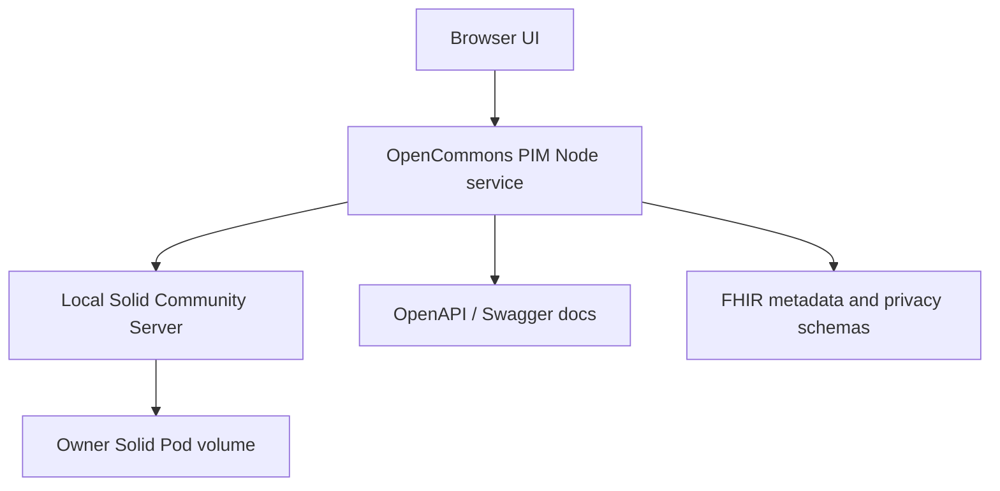
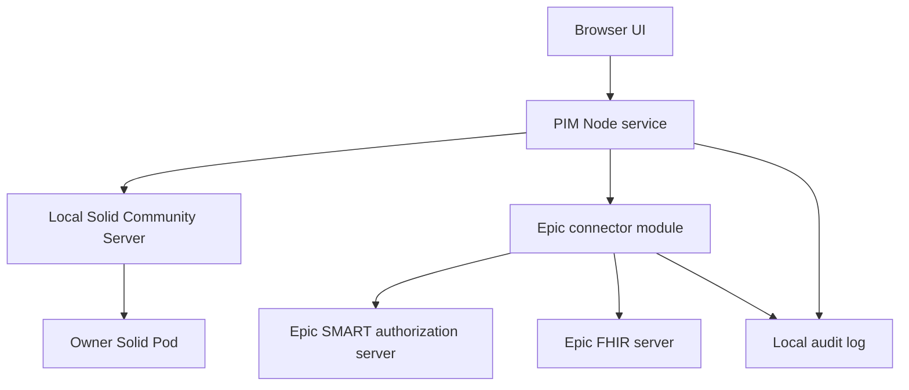

# Operational stack deployment overview

This document describes how OpenCommons Health PIM should be deployed and
operated as the Epic integration work is added.

## Current stack



The current deployment has two supported happy paths:

| Mode | Application | Solid infrastructure | Use when |
|---|---|---|---|
| Container | PIM and CSS run in Docker Compose. | Docker volume-backed local Solid pod and generated client credentials. | You want a fully repeatable local stack. |
| Host-local | PIM runs on the host, CSS runs in Docker. | Port-scoped CSS container and `.solid/` generated credentials. | You are actively developing the Node app and UI. |

Both modes use configurable ports. Continue to avoid hard-coded ports in new
Epic integration work.

Host-local smoke automation is available through:

```bash
APP_PORT=18080 CSS_PORT=13000 npm run local:host-smoke
```

The smoke workflow starts local CSS, starts the host PIM process in the
background, runs `verify-deployment.sh`, and then stops only the host PIM
process. CSS pod data and generated credentials are preserved.

Before either local deployment mode starts Docker Compose, run:

```bash
npm run local:preflight
```

The preflight validates `APP_PORT` and `CSS_PORT`, checks that they are
distinct and available on localhost, and verifies that Docker is reachable for
the local Solid infrastructure. The `local:container` and `local:host-solid`
scripts run this check automatically. Use `SKIP_LOCAL_PREFLIGHT=1` only when
intentionally reusing an already-running local stack.

## MVP boundary

The active MVP scope is localhost-only. Container-local and host-local notebook
deployments are the supported release targets. Native iPad/iPhone packaging,
embedded mobile pod storage, HealthKit/Spezi work, and mobile SMART redirect
implementation are on hold for a future phase.

The localhost MVP is documented in
[`LOCALHOST_MVP_SCOPE.md`](./LOCALHOST_MVP_SCOPE.md). Any new deployment work
for the current MVP should improve one of the two localhost happy paths or the
validation gates that prove those paths remain repeatable.

## Target Epic-enabled stack



Epic integration must be disabled unless explicitly configured. A local
developer should be able to run the existing Solid-only PIM without any Epic
credentials.

## Configuration contract

Epic integration is implemented as an optional connector. The default local
deployment remains Solid-only. When Epic is enabled, the pod stores the
patient-owned connection state and encrypted grant material; app-level Epic
registration values still come from deployment configuration.

| Variable | Required when Epic enabled | Purpose |
|---|---:|---|
| `EPIC_ENABLED` | Yes | Enables Epic connector routes and UI controls. |
| `EPIC_MODE` | Yes | `mock`, `sandbox`, or `production`. |
| `EPIC_FHIR_BASE_URL` | Sandbox/production | Customer or sandbox FHIR base URL. |
| `EPIC_CLIENT_ID` | Sandbox/production | Epic app client ID. |
| `EPIC_CLIENT_SECRET` | Conditional | Optional confidential-client secret. Prefer file-based secrets. |
| `EPIC_CLIENT_SECRET_FILE` | Conditional | Optional path to an untracked confidential-client secret file. |
| `EPIC_REDIRECT_URI` | Sandbox/production | Callback URL registered with Epic. |
| `EPIC_SCOPES` | No | Overrides the default MVP SMART scope set. |
| `EPIC_GRANT_ENCRYPTION_KEY` | Yes | Encrypts patient-owned Epic grant material before it is stored in the Solid pod. |
| `EPIC_SYNC_ON_STARTUP` | No | When true, startup loads pod-owned Epic state and applies a sync if already connected. Default false. |

Port-sensitive values should derive from existing `APP_PORT`, `CSS_PORT`, and
deployment base URL variables.

Implemented MVP API endpoints:

| Endpoint | Purpose |
|---|---|
| `GET /api/integrations/epic/status` | Read sanitized Epic connection status from the Solid pod. |
| `GET /api/integrations/epic/diagnostics` | Check localhost MVP Epic configuration without live credentials by default; use `?live=true` only for explicit SMART discovery. |
| `POST /api/integrations/epic/connect/start` | Start SMART authorization and persist OAuth state in the pod. |
| `GET /api/integrations/epic/connect/callback` | Complete authorization and store encrypted grant material in the pod. |
| `POST /api/integrations/epic/disconnect` | Clear the active grant from pod-owned connection state. |
| `POST /api/integrations/epic/sync/preview` | Map Epic FHIR resources into OpenCommons domain candidates without writing. |
| `POST /api/integrations/epic/sync/apply` | Apply owner-approved import candidates to the Solid pod. |
| `GET /api/integrations/epic/audit` | Read pod-owned Epic integration audit events. |

## Deployment gates

Every Epic-enabled deployment should pass these gates:

1. PIM `/livez` is reachable.
2. PIM `/healthz` and `/api/status` prove authenticated pod access.
3. `/openapi.json`, `/api/docs`, `/fhir/metadata`, and `/api/privacy/schema`
   are reachable.
4. Epic disabled mode hides connector controls and passes existing deployment
   verification.
5. Anonymized release controls deny missing owner approval and return only
   purpose-bound, de-identified payloads when approval is present. The
   `verify-deployment.sh` smoke test enforces this against a temporary
   condition record.
6. Read-only Epic planning surfaces are reachable at
   `/api/planned/epic/documents` and `/api/planned/epic/workflow`; both must
   report `writeEnabled: false` and `piiRelease: false`. The
   `verify-deployment.sh` smoke test enforces this contract.
7. Epic enabled mode verifies:
   - mock mode can connect, preview, and apply synthetic Medicare Wellness data;
   - diagnostics report localhost MVP readiness without exposing secrets;
   - sandbox/production SMART discovery document is reachable;
   - authorization and token endpoints are configured;
   - FHIR capability metadata is reachable;
   - requested scopes match configured feature lanes;
   - no secrets appear in logs or OpenAPI examples.
8. Playwright Medicare Wellness E2E passes against the selected local stack.

For the localhost MVP, the repository also provides
`npm run validate:localhost-mvp` as a static contract check that confirms the
MVP remains scoped to localhost deployment and that the required local scripts,
configuration defaults, and documentation anchors are present.

Use `npm run local:release-gate` before opening a localhost MVP PR. It runs the
non-Docker release checks in one command; live container-local and host-local
smoke tests still run separately because they require Docker and free localhost
ports.

## Security and privacy operations

- Keep Solid credentials and Epic credentials separate.
- Store Epic token material encrypted or in a platform secret store.
- Log authorization events, import previews, save-to-pod decisions, disconnects,
  and anonymized releases.
- Do not log access tokens, refresh tokens, raw documents, message bodies, or
  direct identifiers.
- Use synthetic data in Epic sandbox testing.
- Keep outbound Epic writes disabled until a site-specific workflow, audit
  model, and rollback plan are approved.

## Operational issue checklist

For each deployment issue, capture:

- deployment mode: container or host-local;
- `APP_PORT`, `CSS_PORT`, and public callback URL;
- Epic environment label, never secrets;
- PIM `/api/status` result;
- Epic SMART discovery status;
- FHIR resource or scope that failed;
- whether the failure happened before authorization, during import preview, or
  during pod write.
