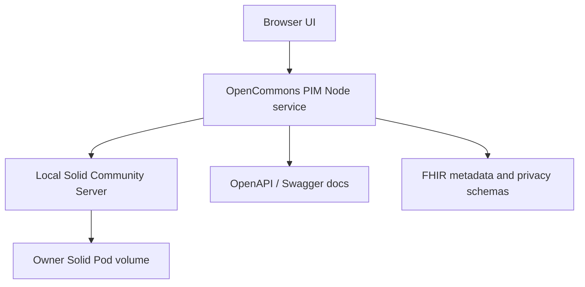
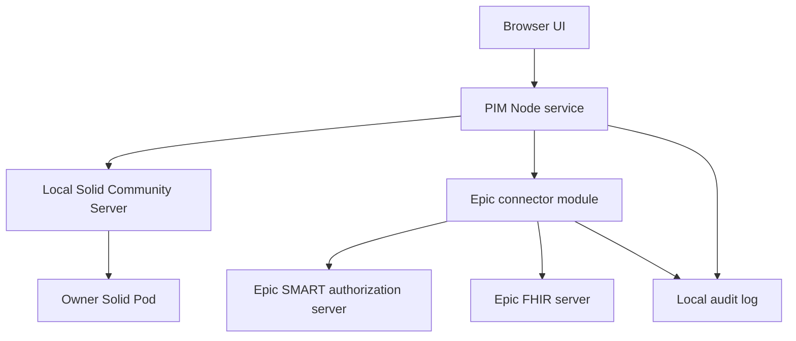

# Operational stack deployment overview

This document describes how OpenCommons Health PIM should be deployed and
operated as the Epic integration work is added.

## Current stack

The current deployment has two supported happy paths:

| Mode | Application | Solid infrastructure | Use when |
|---|---|---|---|
| Container | PIM and CSS run in Docker Compose. | Docker volume-backed local Solid pod and generated client credentials. | You want a fully repeatable local stack. |
| Host-local | PIM runs on the host, CSS runs in Docker. | Port-scoped CSS container and `.solid/` generated credentials. | You are actively developing the Node app and UI. |

Both modes use configurable ports. Continue to avoid hard-coded ports in new
Epic integration work.

## Target Epic-enabled stack

Epic integration must be disabled unless explicitly configured. A local
developer should be able to run the existing Solid-only PIM without any Epic
credentials.

## Configuration contract

Recommended future variables:

| Variable | Required when Epic enabled | Purpose |
|---|---:|---|
| `EPIC_ENABLED` | Yes | Enables Epic connector routes and UI controls. |
| `EPIC_ENVIRONMENT` | Yes | `sandbox`, `nonprod`, or `prod`. |
| `EPIC_FHIR_BASE_URL` | Yes | Customer or sandbox FHIR base URL. |
| `EPIC_CLIENT_ID` | Yes | Epic app client ID. |
| `EPIC_REDIRECT_URI` | Yes | Callback URL registered with Epic. |
| `EPIC_SCOPES` | Yes | Minimum SMART scopes requested by the PIM. |
| `EPIC_CLIENT_SECRET_FILE` | Conditional | Secret file for confidential clients. |
| `EPIC_JWKS_FILE` | Conditional | Private-key/JWKS material for backend services. |
| `EPIC_TOKEN_STORE_PATH` | Conditional | Encrypted local token store path. |
| `EPIC_IMPORT_WINDOW_DAYS` | No | Default bounded import lookback window. |

Port-sensitive values should derive from existing `APP_PORT`, `CSS_PORT`, and
deployment base URL variables.

## Deployment gates

Every Epic-enabled deployment should pass these gates:

1. PIM `/livez` is reachable.
2. PIM `/healthz` and `/api/status` prove authenticated pod access.
3. `/openapi.json`, `/api/docs`, `/fhir/metadata`, and `/api/privacy/schema`
   are reachable.
4. Epic disabled mode hides connector controls and passes existing deployment
   verification.
5. Epic enabled mode verifies:
   - SMART discovery document is reachable;
   - authorization and token endpoints are configured;
   - FHIR capability metadata is reachable;
   - requested scopes match configured feature lanes;
   - no secrets appear in logs or OpenAPI examples.
6. Playwright Medicare Wellness E2E passes against the selected local stack.

## Security and privacy operations

- Keep Solid credentials and Epic credentials separate.
- Store Epic token material encrypted or in a platform secret store.
- Log authorization events, import previews, save-to-pod decisions, disconnects,
  and anonymized releases.
- Do not log access tokens, refresh tokens, raw documents, message bodies, or
  direct identifiers.
- Use synthetic data in Epic sandbox testing.
- Keep outbound Epic writes disabled until a site-specific workflow, audit
  model, and rollback plan are approved.

## Operational issue checklist

For each deployment issue, capture:

- deployment mode: container or host-local;
- `APP_PORT`, `CSS_PORT`, and public callback URL;
- Epic environment label, never secrets;
- PIM `/api/status` result;
- Epic SMART discovery status;
- FHIR resource or scope that failed;
- whether the failure happened before authorization, during import preview, or
  during pod write.

